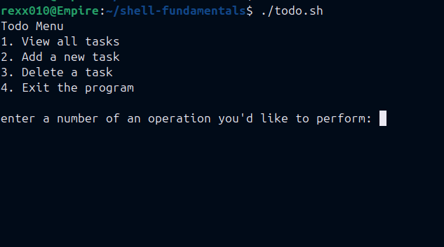
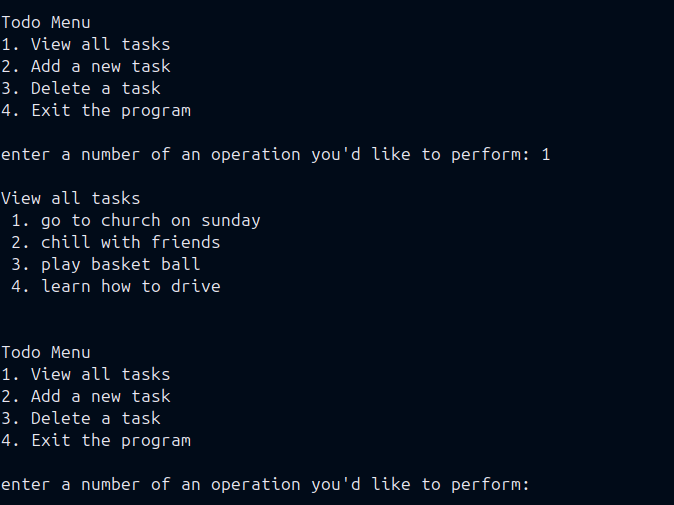
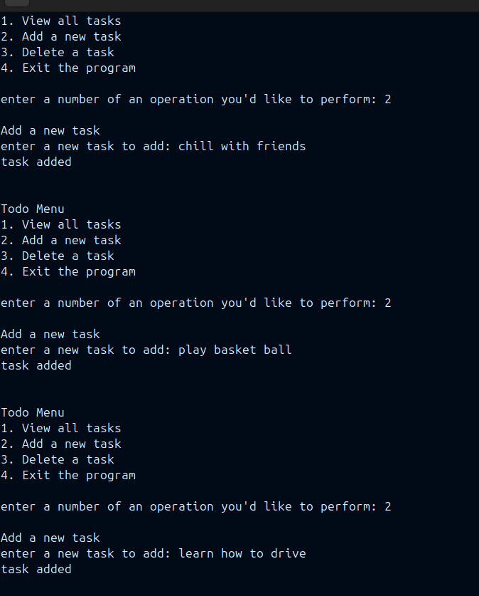
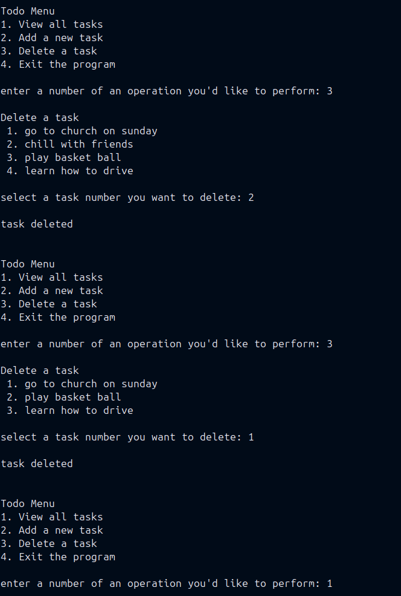
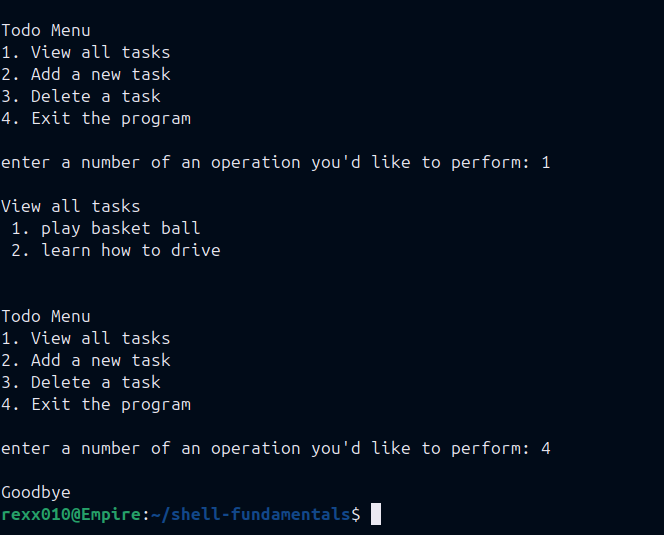

# Shell Fundamentals To-Do App

A simple Bash-based To-Do application built for learning shell scripting fundamentals and basic task automation in Linux.

---

## Features

- View tasks
- Add tasks
- Delete tasks
- Exit program

---

